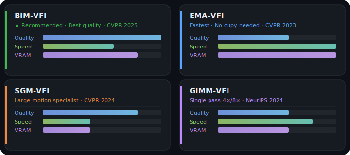

# Tween — Video Frame Interpolation for ComfyUI

[](https://registry.comfy.org/)
[](https://www.python.org/)
[](https://www.apache.org/licenses/LICENSE-2.0)
[](#which-model-should-i-use)

Four video frame interpolation models in one package — **BIM-VFI**, **EMA-VFI**, **SGM-VFI**, and **GIMM-VFI**. Designed for long videos with thousands of frames without running out of VRAM.

<p align="center">
  
</p>

## Installation

Install from the [ComfyUI Registry](https://registry.comfy.org/) (recommended) or clone manually:

```bash
cd ComfyUI/custom_nodes
git clone https://github.com/Ethanfel/ComfyUI-Tween.git
pip install -r requirements.txt
```

All dependencies (`gdown`, `timm`, `omegaconf`, `easydict`, `yacs`, `einops`, `huggingface_hub`) are declared in `pyproject.toml` and `requirements.txt`, installed automatically by ComfyUI Manager or pip.

### cupy (required for BIM-VFI, SGM-VFI, GIMM-VFI)

[cupy](https://cupy.dev/) provides GPU-accelerated optical flow warping. **EMA-VFI works without it.**

1. Find your CUDA version:
   ```bash
   python -c "import torch; print(torch.version.cuda)"
   ```

2. Install the matching package:

   | CUDA | Command |
   |------|---------|
   | 12.x | `pip install cupy-cuda12x` |
   | 11.x | `pip install cupy-cuda11x` |

> Make sure to run pip in the same Python environment as ComfyUI. If cupy is missing, the Load node shows an error with your CUDA version and the exact install command.

<details>
<summary>cupy troubleshooting</summary>

| Problem | Solution |
|---------|----------|
| `ModuleNotFoundError: No module named 'cupy'` | Install cupy using the steps above |
| `cupy` installed but `ImportError` at runtime | CUDA version mismatch — uninstall and reinstall the correct version |
| Install hangs or takes very long | cupy wheels are ~800 MB, be patient |
| Docker / no build tools | Use the prebuilt wheel: `pip install cupy-cuda12x` (not bare `cupy` which compiles from source) |

</details>

## Which model should I use?

| | BIM-VFI | EMA-VFI | SGM-VFI | GIMM-VFI |
|---|---------|---------|---------|----------|
| **Best for** | General-purpose | Fast, low VRAM | Large motion | High multipliers (4x/8x) |
| **Quality** | Highest | Good | Best on large motion | Good |
| **Speed** | Moderate | Fastest | Slowest | Fast for 4x/8x |
| **VRAM** | ~2 GB/pair | ~1.5 GB/pair | ~3 GB/pair | ~2.5 GB/pair |
| **Params** | ~17 M | ~14–65 M | ~15 M + GMFlow | ~80 M (RAFT) / ~123 M (FlowFormer) |
| **Arbitrary timestep** | Yes | Yes (`_t` checkpoint) | No (fixed 0.5) | Yes (native) |
| **4x/8x** | Recursive passes | Recursive passes | Recursive passes | Single forward pass |
| **Requires cupy** | Yes | No | Yes | Yes |
| **Paper** | CVPR 2025 | CVPR 2023 | CVPR 2024 | NeurIPS 2024 |

**TL;DR:** Start with **BIM-VFI** for best quality. Use **EMA-VFI** for speed or if you can't install cupy. Use **SGM-VFI** for large camera motion. Use **GIMM-VFI** for 4x/8x without recursive passes.

## VRAM Guide

| VRAM | Recommended settings |
|------|----------------------|
| 8 GB | `batch_size=1, chunk_size=500` |
| 24 GB | `batch_size=2–4, chunk_size=1000` |
| 48 GB+ | `batch_size=4–16, all_on_gpu=true` |
| 96 GB+ | `batch_size=8–16, all_on_gpu=true, chunk_size=0` |

## Nodes

All Interpolate nodes share a common set of controls:

| Input | Description |
|-------|-------------|
| **images** | Input image batch |
| **model** | Model from the loader node |
| **multiplier** | 2x, 4x, or 8x frame rate (recursive 2x passes) |
| **batch_size** | Frame pairs processed simultaneously (higher = faster, more VRAM) |
| **chunk_size** | Process in segments of N input frames (0 = disabled). Bounds VRAM for very long videos |
| **keep_device** | Keep model on GPU between pairs (faster, ~200 MB constant VRAM) |
| **all_on_gpu** | Keep all intermediate frames on GPU (fast, needs large VRAM) |
| **clear_cache_after_n_frames** | Clear CUDA cache every N pairs to prevent VRAM buildup |
| **source_fps** | Input frame rate. Required when target_fps > 0 |
| **target_fps** | Target output FPS. When > 0, overrides multiplier — auto-computes the optimal power-of-2 oversample then selects frames at exact target timestamps. 0 = use multiplier |

| Output | Description |
|--------|-------------|
| **images** | Interpolated frames at the target FPS (or at the multiplied rate when target_fps = 0) |
| **oversampled** | Full power-of-2 oversampled frames before target FPS selection. Same as `images` when target_fps = 0 |

<details>
<summary><strong>BIM-VFI</strong></summary>

#### Load BIM-VFI Model

Loads the BiM-VFI checkpoint. Auto-downloads from Google Drive on first use to `ComfyUI/models/bim-vfi/`.

| Input | Description |
|-------|-------------|
| **model_path** | Checkpoint from `models/bim-vfi/` |
| **auto_pyr_level** | Auto pyramid level by resolution (&lt;540p=3, 540p=5, 1080p=6, 4K=7) |
| **pyr_level** | Manual pyramid level (3–7), used when auto is off |

#### BIM-VFI Interpolate

Common controls listed above.

#### BIM-VFI Segment Interpolate

Processes a single segment of the input. Chain multiple instances with Save nodes between them to bound peak RAM. The model pass-through output forces sequential execution.

</details>

<details>
<summary><strong>EMA-VFI</strong></summary>

#### Load EMA-VFI Model

Auto-downloads from Google Drive to `ComfyUI/models/ema-vfi/`. Variant and timestep support are auto-detected from the filename.

| Input | Description |
|-------|-------------|
| **model_path** | Checkpoint from `models/ema-vfi/` |
| **tta** | Test-time augmentation (~2x slower, slightly better quality) |

| Checkpoint | Variant | Params | Arbitrary timestep |
|-----------|---------|--------|-------------------|
| `ours_t.pkl` | Large | ~65 M | Yes |
| `ours.pkl` | Large | ~65 M | No (fixed 0.5) |
| `ours_small_t.pkl` | Small | ~14 M | Yes |
| `ours_small.pkl` | Small | ~14 M | No (fixed 0.5) |

#### EMA-VFI Interpolate / Segment Interpolate

Same controls as above.

</details>

<details>
<summary><strong>SGM-VFI</strong></summary>

#### Load SGM-VFI Model

Auto-downloads from Google Drive to `ComfyUI/models/sgm-vfi/`. Requires cupy.

| Input | Description |
|-------|-------------|
| **model_path** | Checkpoint from `models/sgm-vfi/` |
| **tta** | Test-time augmentation (~2x slower, slightly better quality) |
| **num_key_points** | Global matching sparsity (0.0 = global everywhere, 0.5 = default, higher = faster) |

| Checkpoint | Variant | Params |
|-----------|---------|--------|
| `ours-1-2-points.pkl` | Small | ~15 M + GMFlow |

#### SGM-VFI Interpolate / Segment Interpolate

Same controls as above.

</details>

<details>
<summary><strong>GIMM-VFI</strong></summary>

#### Load GIMM-VFI Model

Auto-downloads from [HuggingFace](https://huggingface.co/Kijai/GIMM-VFI_safetensors) to `ComfyUI/models/gimm-vfi/`. The matching flow estimator (RAFT or FlowFormer) is auto-detected and downloaded alongside.

| Input | Description |
|-------|-------------|
| **model_path** | Checkpoint from `models/gimm-vfi/` |
| **ds_factor** | Downscale factor for internal processing (1.0 = full, 0.5 = half). Try 0.5 for 4K inputs |

| Checkpoint | Variant | Params | Flow estimator (auto-downloaded) |
|-----------|---------|--------|----------------------------------|
| `gimmvfi_r_arb_lpips_fp32.safetensors` | RAFT | ~80 M | `raft-things_fp32.safetensors` |
| `gimmvfi_f_arb_lpips_fp32.safetensors` | FlowFormer | ~123 M | `flowformer_sintel_fp32.safetensors` |

#### GIMM-VFI Interpolate

Common controls plus:

| Input | Description |
|-------|-------------|
| **single_pass** | Generate all intermediate frames per pair in one forward pass (default on). No recursive 2x passes needed for 4x/8x. Disable to use the standard recursive approach |

#### GIMM-VFI Segment Interpolate

Same pattern as other Segment nodes.

</details>

### Tween Concat Videos

Concatenates segment video files into a single video using ffmpeg. Connect from any Segment Interpolate's model output to ensure it runs after all segments are saved. Works with all four models.

### Output frame count

- **Multiplier mode:** 2x = 2N-1, 4x = 4N-3, 8x = 8N-7
- **Target FPS mode:** `floor((N-1) / source_fps * target_fps) + 1` frames. Automatically oversamples to the nearest power-of-2 above the ratio, then selects frames at exact target timestamps. Downsampling (target < source) also works — frames are selected from the input with no model calls.

## Acknowledgments

| Model | Authors | Venue | Links |
|-------|---------|-------|-------|
| **BIM-VFI** | Seo, Oh, Kim (KAIST VIC Lab) | CVPR 2025 | [Paper](https://arxiv.org/abs/2412.11365) · [Code](https://github.com/KAIST-VICLab/BiM-VFI) · [Project](https://kaist-viclab.github.io/BiM-VFI_site/) |
| **EMA-VFI** | Zhang et al. (MCG-NJU) | CVPR 2023 | [Paper](https://arxiv.org/abs/2303.00440) · [Code](https://github.com/MCG-NJU/EMA-VFI) |
| **SGM-VFI** | Zhang et al. (MCG-NJU) | CVPR 2024 | [Paper](https://arxiv.org/abs/2404.06913) · [Code](https://github.com/MCG-NJU/SGM-VFI) |
| **GIMM-VFI** | Guo, Li, Loy (S-Lab NTU) | NeurIPS 2024 | [Paper](https://arxiv.org/abs/2407.08680) · [Code](https://github.com/GSeanCDAT/GIMM-VFI) |

GIMM-VFI adaptation from [kijai/ComfyUI-GIMM-VFI](https://github.com/kijai/ComfyUI-GIMM-VFI) with checkpoints from [Kijai/GIMM-VFI_safetensors](https://huggingface.co/Kijai/GIMM-VFI_safetensors). Architecture files in `bim_vfi_arch/`, `ema_vfi_arch/`, `sgm_vfi_arch/`, and `gimm_vfi_arch/` are vendored from their respective repositories with minimal modifications.

<details>
<summary>BibTeX citations</summary>

```bibtex
@inproceedings{seo2025bimvfi,
  title={BiM-VFI: Bidirectional Motion Field-Guided Frame Interpolation for Video with Non-uniform Motions},
  author={Seo, Wonyong and Oh, Jihyong and Kim, Munchurl},
  booktitle={Proceedings of the IEEE/CVF Conference on Computer Vision and Pattern Recognition (CVPR)},
  year={2025}
}

@inproceedings{zhang2023emavfi,
  title={Extracting Motion and Appearance via Inter-Frame Attention for Efficient Video Frame Interpolation},
  author={Zhang, Guozhen and Zhu, Yuhan and Wang, Haonan and Chen, Youxin and Wu, Gangshan and Wang, Limin},
  booktitle={Proceedings of the IEEE/CVF Conference on Computer Vision and Pattern Recognition (CVPR)},
  year={2023}
}

@inproceedings{zhang2024sgmvfi,
  title={Sparse Global Matching for Video Frame Interpolation with Large Motion},
  author={Zhang, Guozhen and Zhu, Yuhan and Liu, Evan Zheran and Wang, Haonan and Sun, Mingzhen and Wu, Gangshan and Wang, Limin},
  booktitle={Proceedings of the IEEE/CVF Conference on Computer Vision and Pattern Recognition (CVPR)},
  year={2024}
}

@inproceedings{guo2024gimmvfi,
  title={Generalizable Implicit Motion Modeling for Video Frame Interpolation},
  author={Guo, Zujin and Li, Wei and Loy, Chen Change},
  booktitle={Advances in Neural Information Processing Systems (NeurIPS)},
  year={2024}
}
```

</details>

## License

**BIM-VFI:** Research and education only. Commercial use requires permission from Prof. Munchurl Kim (mkimee@kaist.ac.kr). See the [original repository](https://github.com/KAIST-VICLab/BiM-VFI).

**EMA-VFI, SGM-VFI, GIMM-VFI:** [Apache 2.0](https://www.apache.org/licenses/LICENSE-2.0). GIMM-VFI ComfyUI adaptation based on [kijai/ComfyUI-GIMM-VFI](https://github.com/kijai/ComfyUI-GIMM-VFI).

**This wrapper code:** [Apache 2.0](https://www.apache.org/licenses/LICENSE-2.0)
