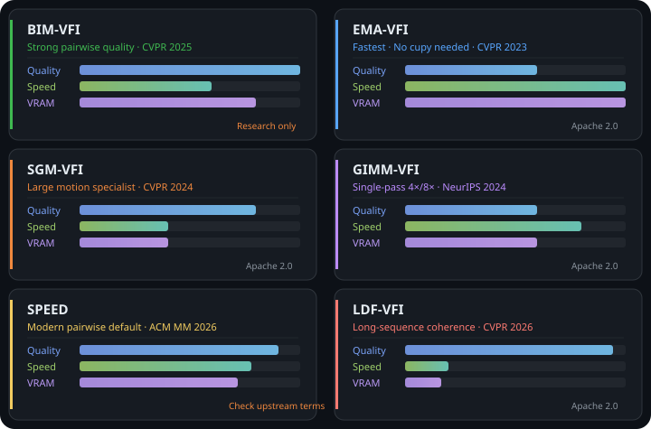

# Tween — Video Frame Interpolation for ComfyUI

[](https://registry.comfy.org/)
[](https://www.python.org/)
[](https://www.apache.org/licenses/LICENSE-2.0)
[](#which-model-should-i-use)

Six video frame interpolation models in one package — **BIM-VFI**, **EMA-VFI**, **SGM-VFI**, **GIMM-VFI**, **SPEED**, and **LDF-VFI**. Pairwise models include chunked/segmented processing; LDF-VFI adds holistic long-sequence diffusion interpolation.

<p align="center">
  
</p>

## Installation

Install from the [ComfyUI Registry](https://registry.comfy.org/) (recommended) or clone manually:

```bash
cd ComfyUI/custom_nodes
git clone https://github.com/Ethanfel/ComfyUI-Tween.git
pip install -r requirements.txt
```

Dependencies are declared in `pyproject.toml` and `requirements.txt` and are installed automatically by ComfyUI Manager or pip. LDF-VFI requires PyTorch 2.5+ plus a current `diffusers`/`accelerate` stack.

### Demo workflow

Import [`example_workflows/tween_speed_ldf_model_lab.json`](example_workflows/tween_speed_ldf_model_lab.json) for the recommended starter graph. It requires [ComfyUI-VideoHelperSuite](https://github.com/Kosinkadink/ComfyUI-VideoHelperSuite) for video loading and encoding.

- The enabled SPEED branch loads a 25-frame, 24 FPS sample, automatically tunes memory settings, interpolates to 48 FPS, preserves audio, and writes `Tween/demo_speed_24_to_48`.
- The LDF-VFI branch is visibly grouped and muted by default so the workflow does not unexpectedly download ~6.4 GB or reserve ~20 GB VRAM. Enable its three coral nodes when you want to compare the sequence-native model.
- Keep the loader's `force_rate`, Tween's `source_fps`/`target_fps`, and Video Combine's `frame_rate` synchronized when changing cadence.

### cupy (accelerates BIM-VFI, SGM-VFI, and GIMM-VFI)

[cupy](https://cupy.dev/) provides GPU-accelerated optical flow warping. **EMA-VFI, SPEED, and LDF-VFI do not use it.**

1. Find your CUDA version:
   ```bash
   python -c "import torch; print(torch.version.cuda)"
   ```

2. Install the matching package:

   | CUDA | Command |
   |------|---------|
   | 12.x | `pip install cupy-cuda12x` |
   | 11.x | `pip install cupy-cuda11x` |

> Make sure to run pip in the same Python environment as ComfyUI. If cupy is missing, the Load node shows an error with your CUDA version and the exact install command.

<details>
<summary>cupy troubleshooting</summary>

| Problem | Solution |
|---------|----------|
| `ModuleNotFoundError: No module named 'cupy'` | Install cupy using the steps above |
| `cupy` installed but `ImportError` at runtime | CUDA version mismatch — uninstall and reinstall the correct version |
| Install hangs or takes very long | cupy wheels are ~800 MB, be patient |
| Docker / no build tools | Use the prebuilt wheel: `pip install cupy-cuda12x` (not bare `cupy` which compiles from source) |

</details>

## Which model should I use?

| Model | Best for | Multiplier path | Typical VRAM | Trade-off |
|-------|----------|-----------------|--------------|-----------|
| **BIM-VFI** | Strong general pairwise quality | Recursive 2x/4x/8x | ~2 GB/pair | Research/education license |
| **EMA-VFI** | Speed and lower VRAM | Recursive 2x/4x/8x | ~1.5 GB/pair | Less robust on extreme motion |
| **SGM-VFI** | Large motion | Recursive 2x/4x/8x | ~3 GB/pair | Slowest pairwise option |
| **GIMM-VFI** | Arbitrary timesteps, efficient 4x/8x | Native multi-frame per pair | ~2.5 GB/pair | Still frame-pair-centric |
| **SPEED** | New high-quality midpoint generation | One diffusion step at 2x; recursive 4x/8x | ~2.3–2.6 GB at benchmark resolutions | Stochastic, ~447 MB checkpoint |
| **LDF-VFI** | Long-range temporal coherence and 2x–16x | Native sequence diffusion | ~20 GB | ~6.4 GB weights; much slower |

**TL;DR:** Try **SPEED** as the modern pairwise default. Use **EMA-VFI** when latency matters, **SGM-VFI** for difficult large motion, **GIMM-VFI** for lightweight arbitrary timesteps, and **LDF-VFI** when sequence consistency matters more than speed or memory.

## VRAM Guide

| VRAM | Recommended settings |
|------|----------------------|
| 8 GB | `batch_size=1, chunk_size=500` |
| 24 GB | `batch_size=2–4, chunk_size=1000` |
| 48 GB+ | `batch_size=4–16, all_on_gpu=true` |
| 96 GB+ | `batch_size=8–16, all_on_gpu=true, chunk_size=0` |

SPEED generally fits the 24 GB tier at HD resolutions. LDF-VFI is a separate workload: its official 8x quick start requires about 20 GB, and higher resolutions may require smaller VAE tiles or more VRAM.

## Nodes

The pairwise Interpolate nodes (BIM/EMA/SGM/GIMM/SPEED) share these controls:

| Input | Description |
|-------|-------------|
| **images** | Input image batch |
| **model** | Model from the loader node |
| **multiplier** | 2x, 4x, or 8x frame rate (recursive 2x passes) |
| **batch_size** | Frame pairs processed simultaneously (higher = faster, more VRAM) |
| **chunk_size** | Process in segments of N input frames (0 = disabled). Bounds VRAM for very long videos |
| **keep_device** | Keep model on GPU between pairs (faster, ~200 MB constant VRAM) |
| **all_on_gpu** | Keep all intermediate frames on GPU (fast, needs large VRAM) |
| **clear_cache_after_n_frames** | Clear CUDA cache every N pairs to prevent VRAM buildup |
| **source_fps** | Input frame rate. Required when target_fps > 0 |
| **target_fps** | Target output FPS. When > 0, overrides multiplier — auto-computes a power-of-2 oversample up to 8x, then selects the nearest generated frame for each target timestamp. 0 = use multiplier |

| Output | Description |
|--------|-------------|
| **images** | Interpolated frames at the target FPS (or at the multiplied rate when target_fps = 0) |
| **oversampled** | Full power-of-2 oversampled frames before target FPS selection. Same as `images` when target_fps = 0 |

<details>
<summary><strong>BIM-VFI</strong></summary>

#### Load BIM-VFI Model

Loads the BiM-VFI checkpoint. Auto-downloads from Google Drive on first use to `ComfyUI/models/bim-vfi/`.

| Input | Description |
|-------|-------------|
| **model_path** | Checkpoint from `models/bim-vfi/` |
| **auto_pyr_level** | Auto pyramid level by resolution (&lt;540p=3, 540p=5, 1080p=6, 4K=7) |
| **pyr_level** | Manual pyramid level (3–7), used when auto is off |

#### BIM-VFI Interpolate

Common controls listed above.

#### BIM-VFI Segment Interpolate

Processes a single segment of the input. Chain multiple instances with Save nodes between them to bound peak RAM. The model pass-through output forces sequential execution.

</details>

<details>
<summary><strong>EMA-VFI</strong></summary>

#### Load EMA-VFI Model

Auto-downloads from Google Drive to `ComfyUI/models/ema-vfi/`. Variant and timestep support are auto-detected from the filename.

| Input | Description |
|-------|-------------|
| **model_path** | Checkpoint from `models/ema-vfi/` |
| **tta** | Test-time augmentation (~2x slower, slightly better quality) |

| Checkpoint | Variant | Params | Arbitrary timestep |
|-----------|---------|--------|-------------------|
| `ours_t.pkl` | Large | ~65 M | Yes |
| `ours.pkl` | Large | ~65 M | No (fixed 0.5) |
| `ours_small_t.pkl` | Small | ~14 M | Yes |
| `ours_small.pkl` | Small | ~14 M | No (fixed 0.5) |

#### EMA-VFI Interpolate / Segment Interpolate

Same controls as above.

</details>

<details>
<summary><strong>SGM-VFI</strong></summary>

#### Load SGM-VFI Model

Auto-downloads from Google Drive to `ComfyUI/models/sgm-vfi/`. Requires cupy.

| Input | Description |
|-------|-------------|
| **model_path** | Checkpoint from `models/sgm-vfi/` |
| **tta** | Test-time augmentation (~2x slower, slightly better quality) |
| **num_key_points** | Global matching sparsity (0.0 = global everywhere, 0.5 = default, higher = faster) |

| Checkpoint | Variant | Params |
|-----------|---------|--------|
| `ours-1-2-points.pkl` | Small | ~15 M + GMFlow |

#### SGM-VFI Interpolate / Segment Interpolate

Same controls as above.

</details>

<details>
<summary><strong>GIMM-VFI</strong></summary>

#### Load GIMM-VFI Model

Auto-downloads from [HuggingFace](https://huggingface.co/Kijai/GIMM-VFI_safetensors) to `ComfyUI/models/gimm-vfi/`. The matching flow estimator (RAFT or FlowFormer) is auto-detected and downloaded alongside.

| Input | Description |
|-------|-------------|
| **model_path** | Checkpoint from `models/gimm-vfi/` |
| **ds_factor** | Downscale factor for internal processing (1.0 = full, 0.5 = half). Try 0.5 for 4K inputs |

| Checkpoint | Variant | Params | Flow estimator (auto-downloaded) |
|-----------|---------|--------|----------------------------------|
| `gimmvfi_r_arb_lpips_fp32.safetensors` | RAFT | ~80 M | `raft-things_fp32.safetensors` |
| `gimmvfi_f_arb_lpips_fp32.safetensors` | FlowFormer | ~123 M | `flowformer_sintel_fp32.safetensors` |

#### GIMM-VFI Interpolate

Common controls plus:

| Input | Description |
|-------|-------------|
| **single_pass** | Generate all intermediate frames per pair in one forward pass (default on). No recursive 2x passes needed for 4x/8x. Disable to use the standard recursive approach |

#### GIMM-VFI Segment Interpolate

Same pattern as other Segment nodes.

</details>

<details>
<summary><strong>SPEED</strong></summary>

#### Load SPEED Model

Downloads the official `speed.pt` checkpoint from [zhZ524/SPEED](https://huggingface.co/zhZ524/SPEED) to `ComfyUI/models/speed-vfi/`. The loader also fetches a checksum-pinned snapshot of the official runtime on first use; Tween does not bundle that source.

| Input | Description |
|-------|-------------|
| **model_path** | Checkpoint from `models/speed-vfi/` (official default is ~447 MB) |
| **precision** | `auto` prefers BF16, then FP16; FP32 is available for comparison |

#### SPEED Interpolate / Segment Interpolate

Uses the same batching, chunking, segment, and exact-target-FPS controls as BIM-VFI, plus a `seed` input for repeatable starting pixel noise. Keeping the seed on the interpolation node lets it change without reloading the model. SPEED is repeatable for the same seed and execution settings; changing batch, chunk, or segment boundaries can change how its stochastic noise is assigned. The released model predicts only the midpoint, so 4x and 8x are recursive passes. Inputs are padded to the model's 64-pixel divisor and cropped back automatically.

</details>

<details>
<summary><strong>LDF-VFI</strong></summary>

#### Load LDF-VFI Model

Downloads the official transformer and conditional VAE from [onecat-ai/LDF-VFI](https://huggingface.co/onecat-ai/LDF-VFI) to `ComfyUI/models/ldf-vfi/` (~6.4 GB total). A checksum-pinned Apache-2.0 runtime snapshot is fetched on first use. Loading stays on CPU until the interpolation node executes.

| Input | Description |
|-------|-------------|
| **tile_size / tile_overlap** | Spatial VAE tiling and seam blending; default 256/64 |
| **vae_batch_size** | Lower first if VAE encode/decode runs out of VRAM |
| **attention_type** | Official `slide_chunk_all_block_2x1x1` sparse attention is recommended |

#### LDF-VFI Sequence Interpolate

LDF-VFI is not a pairwise node. It processes the ordered source batch with the paper's skip-concat autoregressive sampler and internally chunks long sequences without breaking temporal context.

| Input | Description |
|-------|-------------|
| **temporal_factor** | Any integer from 2x through 16x |
| **sampling_steps** | Diffusion steps per temporal block; official quick start uses 16 |
| **t_shift / t_cond** | Official defaults are 8.0 / 0.1 |
| **seed** | Repeatable VAE and diffusion sampling |
| **offload_after** | Return transformer and VAE to CPU after generation |
| **source_fps / target_fps** | Optional exact-FPS selection using the smallest sufficient native factor |

The second output, `generated_sequence`, is the full native-factor sequence before exact-FPS selection. LDF has no Segment node because externally splitting the sequence would discard the long-range context it is designed to preserve.

</details>

### Tween Concat Videos

Concatenates segment video files into a single video using ffmpeg. Connect from any pairwise Segment Interpolate's model output to ensure it runs after all segments are saved.

### Output frame count

- **Pairwise multiplier mode:** 2x = 2N-1, 4x = 4N-3, 8x = 8N-7
- **LDF-VFI native factor:** factor `F` = `F(N-1)+1`, for any integer `F` from 2 through 16
- **Target FPS mode:** `floor((N-1) / source_fps * target_fps) + 1` frames. Pairwise nodes oversample to the nearest power-of-2 above the ratio (up to 8x), then select the nearest generated frame for each target timestamp. Downsampling (target < source) also works — frames are selected from the input with no model calls. LDF-VFI supports native factors up to 16x.

In target-FPS Segment mode, a very small `segment_size` can cover less than one output-frame interval while downsampling. Increase `segment_size` if the node reports that the segment contains no target timestamps; returning a placeholder frame would make concatenated timing incorrect.

## Acknowledgments

| Model | Authors | Venue | Links |
|-------|---------|-------|-------|
| **BIM-VFI** | Seo, Oh, Kim (KAIST VIC Lab) | CVPR 2025 | [Paper](https://arxiv.org/abs/2412.11365) · [Code](https://github.com/KAIST-VICLab/BiM-VFI) · [Project](https://kaist-viclab.github.io/BiM-VFI_site/) |
| **EMA-VFI** | Zhang et al. (MCG-NJU) | CVPR 2023 | [Paper](https://arxiv.org/abs/2303.00440) · [Code](https://github.com/MCG-NJU/EMA-VFI) |
| **SGM-VFI** | Zhang et al. (MCG-NJU) | CVPR 2024 | [Paper](https://arxiv.org/abs/2404.06913) · [Code](https://github.com/MCG-NJU/SGM-VFI) |
| **GIMM-VFI** | Guo, Li, Loy (S-Lab NTU) | NeurIPS 2024 | [Paper](https://arxiv.org/abs/2407.08680) · [Code](https://github.com/GSeanCDAT/GIMM-VFI) |
| **SPEED** | Zhang et al. | ACM MM 2026 | [Paper](https://arxiv.org/abs/2607.15585) · [Code](https://github.com/bbldCVer/SPEED) · [Model](https://huggingface.co/zhZ524/SPEED) |
| **LDF-VFI** | Peng et al. | CVPR 2026 | [Paper](https://arxiv.org/abs/2601.14959) · [Code](https://github.com/xypeng9903/LDF-VFI) · [Model](https://huggingface.co/onecat-ai/LDF-VFI) |

GIMM-VFI adaptation from [kijai/ComfyUI-GIMM-VFI](https://github.com/kijai/ComfyUI-GIMM-VFI) with checkpoints from [Kijai/GIMM-VFI_safetensors](https://huggingface.co/Kijai/GIMM-VFI_safetensors). Architecture files in `bim_vfi_arch/`, `ema_vfi_arch/`, `sgm_vfi_arch/`, and `gimm_vfi_arch/` are vendored from their respective repositories with minimal modifications. SPEED and LDF-VFI use checksum-pinned official source snapshots downloaded into their model directories on demand.

<details>
<summary>BibTeX citations</summary>

```bibtex
@inproceedings{seo2025bimvfi,
  title={BiM-VFI: Bidirectional Motion Field-Guided Frame Interpolation for Video with Non-uniform Motions},
  author={Seo, Wonyong and Oh, Jihyong and Kim, Munchurl},
  booktitle={Proceedings of the IEEE/CVF Conference on Computer Vision and Pattern Recognition (CVPR)},
  year={2025}
}

@inproceedings{zhang2023emavfi,
  title={Extracting Motion and Appearance via Inter-Frame Attention for Efficient Video Frame Interpolation},
  author={Zhang, Guozhen and Zhu, Yuhan and Wang, Haonan and Chen, Youxin and Wu, Gangshan and Wang, Limin},
  booktitle={Proceedings of the IEEE/CVF Conference on Computer Vision and Pattern Recognition (CVPR)},
  year={2023}
}

@inproceedings{zhang2024sgmvfi,
  title={Sparse Global Matching for Video Frame Interpolation with Large Motion},
  author={Zhang, Guozhen and Zhu, Yuhan and Liu, Evan Zheran and Wang, Haonan and Sun, Mingzhen and Wu, Gangshan and Wang, Limin},
  booktitle={Proceedings of the IEEE/CVF Conference on Computer Vision and Pattern Recognition (CVPR)},
  year={2024}
}

@inproceedings{guo2024gimmvfi,
  title={Generalizable Implicit Motion Modeling for Video Frame Interpolation},
  author={Guo, Zujin and Li, Wei and Loy, Chen Change},
  booktitle={Advances in Neural Information Processing Systems (NeurIPS)},
  year={2024}
}

@misc{zhang2026speed,
  title={SPEED: One-Step Pixel Diffusion for High-quality Video Frame Interpolation},
  author={Zhang, Zihao and Zhao, Haoyu and Yang, Siqian and Wu, Yidi and Jiang, Yudong and Wu, Zuxuan},
  year={2026},
  eprint={2607.15585},
  archivePrefix={arXiv}
}

@misc{peng2026holistic,
  title={Towards Holistic Modeling for Video Frame Interpolation with Auto-regressive Diffusion Transformers},
  author={Peng, Xinyu and Li, Han and Huang, Yuyang and Zheng, Ziyang and Wang, Yaoming and Chen, Xin and Dai, Wenrui and Li, Chenglin and Zou, Junni and Xiong, Hongkai},
  year={2026},
  eprint={2601.14959},
  archivePrefix={arXiv}
}
```

</details>

## License

**BIM-VFI:** Research and education only. Commercial use requires permission from Prof. Munchurl Kim (mkimee@kaist.ac.kr). See the [original repository](https://github.com/KAIST-VICLab/BiM-VFI).

**EMA-VFI, SGM-VFI, GIMM-VFI, LDF-VFI:** [Apache 2.0](https://www.apache.org/licenses/LICENSE-2.0). GIMM-VFI ComfyUI adaptation based on [kijai/ComfyUI-GIMM-VFI](https://github.com/kijai/ComfyUI-GIMM-VFI).

**SPEED:** The official source repository did not include a license file when this integration was pinned. Tween does not redistribute that source; the loader downloads it directly from the official repository. Review the upstream terms before redistribution or commercial use. The checkpoint is likewise downloaded from its official Hugging Face repository.

**This wrapper code:** [Apache 2.0](https://www.apache.org/licenses/LICENSE-2.0)
